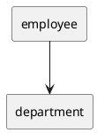
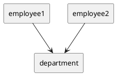
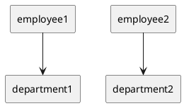

# Object Copying in Java

Let us assume an object employee contain department object.

##


## Shallow copying:
It creates a new `instance` of the same class and copies all the fields to the
new instance and returns it. **_Object class_** provides a `clone` method
and provides support for the shallow copying.

Below diagram shows, only employee1 object has been clone, not department object.
If you change data on department object, it will be reflected to both employee1 and
employee2 object.

##


## Deep copying:
A deep copy occurs when an object is copied along with the objects to which it refers. Below
diagram shows `employee1` after a deep copy has been performed on it. Not only has `obj1` been copied,
but the objects contained within it have been copied as well. We can use **_Java Object Serialization_**
to make a deep copy. Unfortunately, this approach has some problems too
([detailed examples](http://javatechniques.com/blog/faster-deep-copies-of-java-objects/)).

##


## Defensive copying

A mutable object is simply an object which can change its state after construction. For example, StringBuilder and Date are mutable objects, while String and Integer are immutable objects.
A class may have a mutable object as a field. There are two possible cases for how the state of a mutable object field can change:

its state can be changed only by the native class - the native class creates the mutable object field, and is the only class which is directly aware of its existence
its state can be changed both by the native class and by its callers - the native class simply points to a mutable object which was created elsewhere
Both cases are valid design choices, but you must be aware of which one is appropriate for each case.
If the mutable object field's state should be changed only by the native class, then a defensive copy of the mutable object must be made any time it's passed into (constructors and set methods) or out of (get methods) the class. If this is not done, then it's simple for the caller to break encapsulation, by changing the state of an object which is simultaneously visible to both the class and its caller.

### Example

Planet has a mutable object field fDateOfDiscovery, which is defensively copied in all constructors, and in getDateOfDiscovery. Planet represents an immutable class, and has no set methods for its fields. Note that if the defensive copy of DateOfDiscovery is not made, then Planet is no longer immutable!

```java
import java.util.Date;

/**
* Planet is an immutable class, since there is no way to change
* its state after construction.
*/
public final class Planet {

  public Planet (double mass, String name, Date dateOfDiscovery) {
     this.mass = mass;
     this.name = name;
     //make a private copy of aDateOfDiscovery
     //this is the only way to keep the fDateOfDiscovery
     //field private, and shields this class from any changes that
     //the caller may make to the original aDateOfDiscovery object
     this.dateOfDiscovery = new Date(dateOfDiscovery.getTime());
  }

  /**
  * Returns a primitive value.
  *
  * The caller can do whatever they want with the return value, without
  * affecting the internals of this class. Why? Because this is a primitive
  * value. The caller sees its "own" double that simply has the
  * same value as fMass.
  */
  public double getMass() {
    return mass;
  }

  /**
  * Returns an immutable object.
  *
  * The caller gets a direct reference to the internal field. But this is not
  * dangerous, since String is immutable and cannot be changed.
  */
  public String getName() {
    return name;
  }

//  /**
//  * Returns a mutable object - likely bad style.
//  *
//  * The caller gets a direct reference to the internal field. This is usually dangerous,
//  * since the Date object state can be changed both by this class and its caller.
//  * That is, this class is no longer in complete control of dateOfDiscovery.
//  */
//  public Date getDateOfDiscovery() {
//    return dateOfDiscovery;
//  }

  /**
  * Returns a mutable object - good style.
  *
  * Returns a defensive copy of the field.
  * The caller of this method can do anything they want with the
  * returned Date object, without affecting the internals of this
  * class in any way. Why? Because they do not have a reference to
  * fDate. Rather, they are playing with a second Date that initially has the
  * same data as fDate.
  */
  public Date getDateOfDiscovery() {
    return new Date(dateOfDiscovery.getTime());
  }

  // PRIVATE

  /**
  * Final primitive data is always immutable.
  */
  private final double mass;

  /**
  * An immutable object field. (String objects never change state.)
  */
  private final String name;

  /**
  * A mutable object field. In this case, the state of this mutable field
  * is to be changed only by this class. (In other cases, it makes perfect
  * sense to allow the state of a field to be changed outside the native
  * class; this is the case when a field acts as a "pointer" to an object
  * created elsewhere.)
  *
  * java.util.Date is used here only because its convenient for illustrating
  * a point about mutable objects. In new code, you should use
  * java.time classes, not java.util.Date.
  */
  private final Date dateOfDiscovery;
}
```

## Copy constructors
- Provide an attractive alternative to the rather pathological clone method
- are easily implemented
- simply extract the argument's data, and forward to a regular constructor
- are unnecessary for immutable objects

```java
/** With corrections from Bernardo Sulzbach. */
public final class Galaxy {

  /**
  * Regular constructor.
  */
  public Galaxy(Double mass, String name) {
    this.mass = mass;
    this.name = name;
  }

  /**
  * Copy constructor.
  */
  public Galaxy(Galaxy galaxy) {
    this(galaxy.getMass(), galaxy.getName());
    //no defensive copies are created here, since
    //there are no mutable object fields (String is immutable)
  }

  /**
  * Alternative style for a copy constructor, using a static newInstance
  * method.
  */
  public static Galaxy newInstance(Galaxy galaxy) {
    return new Galaxy(galaxy.getMass(), galaxy.getName());
  }

  public Double getMass() {
    return mass;
  }

  /**
  * This is the only method which changes the state of a Galaxy
  * object. If this method was removed, then a copy constructor
  * would not be provided either, since immutable objects do not
  * need a copy constructor.
  */
  public void setMass(Double aMass){
    mass = aMass;
  }

  public String getName() {
    return name;
  }

  // PRIVATE

  /**
   Using Double instead of BigDecimal here: the context is scientific!
  */
  private Double mass;
  private final String name;

  /** Test harness. */
  public static void main (String... args){
    Galaxy m101 = new Galaxy(15.0, "M101");

    Galaxy m101CopyOne = new Galaxy(m101);
    m101CopyOne.setMass(25.0);

    Galaxy m101CopyTwo = Galaxy.newInstance(m101);
    m101CopyTwo.setMass(35.0);

    log("M101 mass: " + m101.getMass());
    log("M101CopyOne mass: " + m101CopyOne.getMass());
    log("M101CopyTwo mass: " + m101CopyTwo.getMass());
  }

  private static void log(String msg) {
    System.out.println(msg);
  }
}

Example run of this class:
>java -cp . Galaxy
    M101 mass: 15.0
    M101CopyOne mass: 25.0
    M101CopyTwo mass: 35.0
```