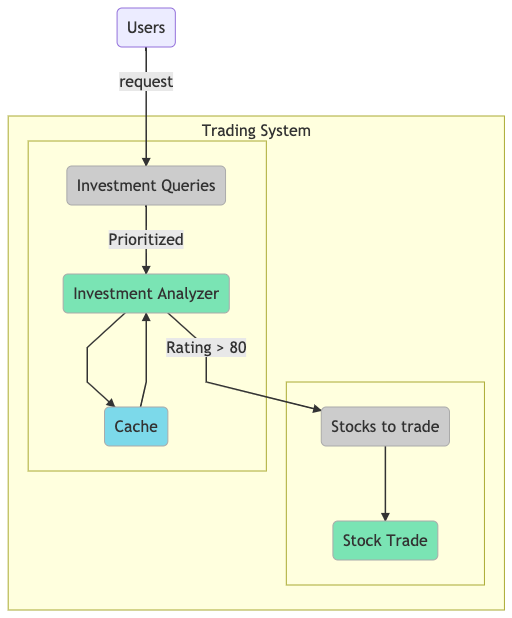

# Stock Trader

## Design


## Findings
### Stock Trade
- reads first index from list of investment query
- process it
- removes first index from list of investment query
- At first : ArrayList (add: O(1), remove: O(N))
- Later : LinkedList (add: O(1), remove: O(1)) --> Improves the performance

### Investment Queries
- reads the highest priority query
- In ArrayList, reading highest priority query needs to be filter : O(N)
- In PriorityQueue, this is done at the time of insertion
- process it
- remove it from the list
- At first : ArrayList (add: O(1), remove: O(N))
- Later: PriorityQueue (add: O(log N), remove: O(log n)) --> Improves the performance

### Cache
- reads the rating if available
- store the rating if not available
- At first : ArrayList (find: O(N), add: O(1))
- Later: HashMap (find: O(1), add: O(1)) --> Improves the performance


## First run
```
Trading 200000 stocks... [{200000} stocks]  Done in 3.583s
Querying... Done in 0.113s
Analyzing queries... Done in 134.891s
Handling tradings... [{18280} stocks]  Done in 0.019s
```

## Improve handling trading performance
```
Trading 200000 stocks... [{200000} stocks]  Done in 0.557s
Querying... Done in 0.115s
Analyzing queries... Done in 126.475s
Handling tradings... [{18649} stocks]  Done in 0.002s
```

## Improve analyzing queries and caching performance
```
Trading 200000 stocks... [{200000} stocks]  Done in 0.538s
Querying... Done in 0.128s
Analyzing queries... Done in 0.106s
Handling tradings... [{18309} stocks]  Done in 0.001s

Trading 200000 stocks... [{200000} stocks]  Done in 0.569s
Querying... Done in 0.128s
Analyzing queries... Done in 0.102s
Handling tradings... [{18535} stocks]  Done in 0.001s

Trading 200000 stocks... [{200000} stocks]  Done in 0.545s
Querying... Done in 0.109s
Analyzing queries... Done in 0.126s
Handling tradings... [{18348} stocks]  Done in 0.001s
```
