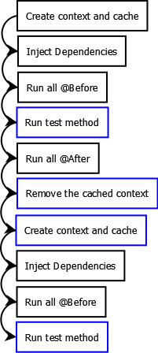

# Spring Dirty Context

## Description
`@DirtiesContext` is a spring test annotation which is used to indicate
that the application context cached should be removed and reloaded after
each test run. The application context removed will also be closed.
`@DirtiesContext` can be declared at method level as well as class level.

## @DirtiesContext Flow
If the test method is annotated with `@DirtiesContext` or if the test class
is annotated with `@DirtiesContext` with classMode set to
`ClassMode.AFTER_EACH_TEST_METHOD`, then the application context of the test
context will be marked as dirty and closed.

If `@DirtiesContext` is declared at class level with classMode set to
`ClassMode.AFTER_CLASS` then the application context will be closed after
all the tests of the test class are run.




## Example without @DirtiesContext
In our example will use an employee bean which will auto-wire then use
the auto-wired bean in each test case. If we have not used `@DirtiesContext`
annotation then we will have have one employee bean which will be shared
by all test cases.

All the tests use the same employee instance as you can see employee name
set in `emp3Test()` and the one fetched in the before method for the next
test run are the same.

### Output
```log
emp1Test: Employee(Roy)
afterTest: Employee(Roy)
beforeTest: Employee(Roy)
emp2Test Employee(Roy)
afterTest: Employee(Sam)
beforeTest: Employee(Sam)
emp3Test Employee(Roy)
afterTest: Employee(Kim)
beforeTest: Employee(Kim)
emp4Test Employee(Roy)
afterTest: Employee(Rita)
```

## @DirtiesContext at Test Level
If we annotate a test method with `@DirtiesContext` then the context will
be closed and removed from the cache after the test’s run. The context
will be reloaded before the start of the next test.

`emp1Test()` and `emp2Test()` tests are annotated with `@DirtiesContext`.
After the test is run, the context is closed and removed from cache.
`emp3Test()` and `emp4Test()` doesn’t have `@DirtiesContext` so ended up
reusing the same employee bean.

### Output
```log
Mar 09, 2016 9:56:10 PM org.springframework.context.support.GenericApplicationContext prepareRefresh
INFO: Refreshing org.springframework.context.support.GenericApplicationContext@3fb6a447: startup date [Wed Mar 09 21:56:10 IST 2016]; root of context hierarchy
beforeTest: Employee(null)
emp1Test: Employee(Roy)
afterTest: Employee(Roy)
Mar 09, 2016 9:56:10 PM org.springframework.context.support.GenericApplicationContext doClose
INFO: Closing org.springframework.context.support.GenericApplicationContext@3fb6a447: startup date [Wed Mar 09 21:56:10 IST 2016]; root of context hierarchy
Mar 09, 2016 9:56:10 PM org.springframework.context.support.GenericApplicationContext prepareRefresh
INFO: Refreshing org.springframework.context.support.GenericApplicationContext@10e92f8f: startup date [Wed Mar 09 21:56:10 IST 2016]; root of context hierarchy
beforeTest: Employee(null)
emp2Test Employee(Roy)
afterTest: Employee(Sam)
Mar 09, 2016 9:56:10 PM org.springframework.context.support.GenericApplicationContext doClose
INFO: Closing org.springframework.context.support.GenericApplicationContext@10e92f8f: startup date [Wed Mar 09 21:56:10 IST 2016]; root of context hierarchy
Mar 09, 2016 9:56:10 PM org.springframework.context.support.GenericApplicationContext prepareRefresh
INFO: Refreshing org.springframework.context.support.GenericApplicationContext@635eaaf1: startup date [Wed Mar 09 21:56:10 IST 2016]; root of context hierarchy
beforeTest: Employee(null)
emp3Test Employee(Roy)
afterTest: Employee(Kim)
beforeTest: Employee(Kim)
emp4Test Employee(Roy)
afterTest: Employee(Rita)
Mar 09, 2016 9:56:10 PM org.springframework.context.support.GenericApplicationContext doClose
INFO: Closing org.springframework.context.support.GenericApplicationContext@635eaaf1: startup date [Wed Mar 09 21:56:10 IST 2016]; root of context hierarchy
```

## @DirtiesContext at Class Level
You can also declare `@DirtiesContext` at class level. You can use classMode
attribute to define when to mark the context as dirty. In our example,
we have set it to `ClassMode.AFTER_EACH_TEST_METHOD` so that the associated
context is marked as dirty after each test method in the class. If it is
set to `ClassMode.AFTER_CLASS`, it will marked as dirty after the test class.

### Output
```log
Mar 09, 2016 9:53:58 PM org.springframework.context.support.GenericApplicationContext prepareRefresh
INFO: Refreshing org.springframework.context.support.GenericApplicationContext@79b4d0f: startup date [Wed Mar 09 21:53:58 IST 2016]; root of context hierarchy
beforeTest: Employee(null)
emp1Test: Employee(Roy)
afterTest: Employee(Roy)
Mar 09, 2016 9:53:59 PM org.springframework.context.support.GenericApplicationContext doClose
INFO: Closing org.springframework.context.support.GenericApplicationContext@79b4d0f: startup date [Wed Mar 09 21:53:58 IST 2016]; root of context hierarchy
Mar 09, 2016 9:53:59 PM org.springframework.context.support.GenericApplicationContext prepareRefresh
INFO: Refreshing org.springframework.context.support.GenericApplicationContext@10e92f8f: startup date [Wed Mar 09 21:53:59 IST 2016]; root of context hierarchy
beforeTest: Employee(null)
emp2Test Employee(Roy)
afterTest: Employee(Sam)
Mar 09, 2016 9:53:59 PM org.springframework.context.support.GenericApplicationContext doClose
INFO: Closing org.springframework.context.support.GenericApplicationContext@10e92f8f: startup date [Wed Mar 09 21:53:59 IST 2016]; root of context hierarchy
Mar 09, 2016 9:53:59 PM org.springframework.context.support.GenericApplicationContext prepareRefresh
INFO: Refreshing org.springframework.context.support.GenericApplicationContext@635eaaf1: startup date [Wed Mar 09 21:53:59 IST 2016]; root of context hierarchy
beforeTest: Employee(null)
emp3Test Employee(Roy)
afterTest: Employee(Kim)
Mar 09, 2016 9:53:59 PM org.springframework.context.support.GenericApplicationContext doClose
INFO: Closing org.springframework.context.support.GenericApplicationContext@635eaaf1: startup date [Wed Mar 09 21:53:59 IST 2016]; root of context hierarchy
Mar 09, 2016 9:53:59 PM org.springframework.context.support.GenericApplicationContext prepareRefresh
INFO: Refreshing org.springframework.context.support.GenericApplicationContext@1afd44cb: startup date [Wed Mar 09 21:53:59 IST 2016]; root of context hierarchy
beforeTest: Employee(null)
emp4Test Employee(Roy)
afterTest: Employee(Rita)
Mar 09, 2016 9:53:59 PM org.springframework.context.support.GenericApplicationContext doClose
INFO: Closing org.springframework.context.support.GenericApplicationContext@1afd44cb: startup date [Wed Mar 09 21:53:59 IST 2016]; root of context hierarchy
```