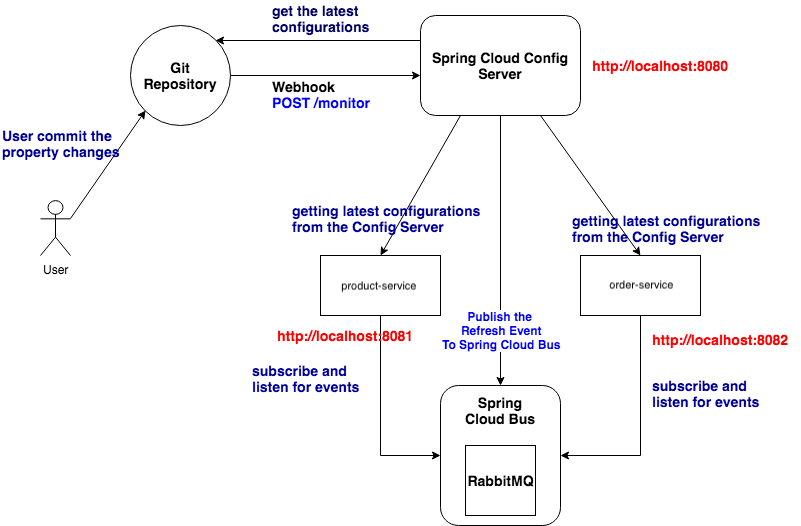

# Spring Cloud Configuration using Cloud Bus

## Spring Cloud Stream  (spring-cloud-starter-stream-rabbit)
`Spring Cloud Stream` is a framework that supports in developing `message driven
or event driven microservices`. `spring-cloud-starter-stream-rabbit` is a specific 
implementation of `Spring Cloud Stream that uses RabbitMQ message broker`
as underlying message broker.

e.g:- If you want to use the Kafka as the underlying message broker, 
then you have to use the dependency `spring-cloud-starter-stream-kafka` instead of this.

`spring-cloud-starter-stream-rabbit` is used to send/publish event notifications 
from the Config Server to a RabbitMQ exchange (again, only if spring.cloud.bus 
property is enabled). The Spring Cloud Bus will broadcast the event (refresh event) 
to all related services.

## What is Spring Cloud Bus ?
Spring Cloud Bus links the independent services in the micro-services 
environment through a light weight message broker (e.g:- RabbitMQ or Kafka).  
This message broker can be used to broadcast the configuration changes and events.
In addition, it can be used as a communication channel among independent services.

A key idea is that the Bus is like a distributed Actuator for a Spring Boot 
application that is scaled out, but it can also be used as a communication 
channel between applications.

## What is the difference between Spring Cloud Stream and Spring Cloud Bus?
`Spring Cloud Stream` is a framework that helps to develop 
`message driven or event driven microservices`. It uses underlying message broker
 (such as RabbitMQ or Kafka) to publish event and messages across application services.

`Spring Cloud Bus` connects the distributed services through a message
broker (known as RabbitMQ or Kafka). Therefore it can broadcast and deliver 
the published event and message to the related service. `Spring Cloud Bus` is 
built on `Spring Cloud Stream`. Therefore `Spring Cloud Bus` can be identified 
as the application use of `Spring Cloud Stream`.

## How it works?
- `product-service` requests the property from the `spring-cloud-config-server` 

- `spring-cloud-config-server` access the configured property source 
(here it is the the Git repository)

- `spring-cloud-config-server` receives the latest configurations 
from `Git Repository` (property source).

- `product-service` receives the latest properties from config-server.

- `admin/user/configuration_updater` has made a changed to property 
files and updated the Git repository.

- whenever the update is pushed to the `Git Repository`, 
it will send the Webhook event to the registered application. That is the 
`/monitor` endpoint of the Spring Cloud Config Server.

- then the `Spring Cloud Config Server` will retrieve the latest configuration
property changes from the `Git repository` and publish the `refresh event` to the
`Spring Cloud Bus`. This refresh event is published with `Spring Cloud Stream`.

- all the distributed application services will connect to `Spring Cloud Bus`
and will listen for the `refresh event` published by the `Spring Cloud Config Server`.

- `Spring Cloud Bus` will broadcast the `refresh event` across all connected
application services.

- therefore it is guaranteed that the the published refresh event will be received
by every distributed service (Config Client) that is connected to the `Spring Cloud Bus`.


## The property file naming rule
- The name should start with the application name as declared in the relevant service.

    e.g:-  spring.application.name = product-service

- If there different profiles, the profile name should comes after the application name.

    e.g:- product-service-uat.properties , product-service-qa.properties  (or .yml)

> The spring cloud config server will pick the correct property file based on the 
application name and the activated profile name. If no profile is 
activated/mentioned explicitly, it will pick the property file with no profile suffix.
    e.g:- product-service.properties (or .yml)

## Config Server Endpoints
- REST endpoints to get the application specific configuration properties.
```
GET /{application}/{profile}[/{label}]
GET /{application}-{profile}.yml
GET /{label}/{application}-{profile}.yml
GET /{application}-{profile}.properties
GET /{label}/{application}-{profile}.properties
```

- `{application}` refers to value of spring.config.name property
- `{profile}` is an active profile
- `{label}` is an optional git label (defaults to “master”).

e.g. : http://localhost:8081/product-service/default

- Response:
    - product-service default configuration details
    - application.properties (.yml) configuration if available

### Simulating Webhook
```
curl -v -X POST "http://localhost:8080/monitor" \
-H "Content-Type: application/json" \
-H "X-Event-Key: repo:push" \
-H "X-Hook-UUID: webhook-uuid" \
-d '{"push": {"changes": []} }'
```
## Product Service

### Dependency
- `Config Client`: for retrieving the properties from the Config Server.

- `Actuator`: for invoking the `/actuator/bus-refresh` endpoint for retrieving the 
latest property changes from Config Server.

- `Spring Cloud Bus`: for communication between services using rabbitmq

### RabbitMQ Setup
```
docker pull rabbitmq:3-management
docker run -d --hostname my-rabbit --name rabbitmq -p 15672:15672 -p 5672:5672 rabbitmq:3-management
```

## What we do?
Here we are going to use the `Spring Cloud Bus` to broadcast the refresh event across all services.
Therefore whenever the property is changed, we need to trigger the refresh event
for the `Spring Cloud Bus`. This can be done with invoking  `/actuator/bus-refresh`
endpoint through any of the connected services (any service that is connected 
to the `Spring Cloud Bus`). Then the `Spring Cloud Bus` will broadcast the `refresh 
event` across all the connected services.

In this way, it is possible to trigger the refresh event in one service and get 
it reflected in all other connected services.

## Reference
### spring-cloud-config-monitor
spring-cloud-config-monitor provides a `/monitor` endpoint for the Config Server to 
receive notification events when the properties backed by a `Git repository` are changed.
This will work if and only if `spring.cloud.bus` property is enabled.

>spring.cloud.bus.enabled = true  #add to the application.properties of Config Server

## webhook
Many source code repository providers (such as Github, Gitlab, or Bitbucket) notify you
of changes in a repository through a webhook. You can configure the webhook through 
the provider’s user interface as a URL and a set of events in which you are interested.
For instance, Github uses a POST to the webhook with a JSON body containing a list of commits.

## How it flows?
