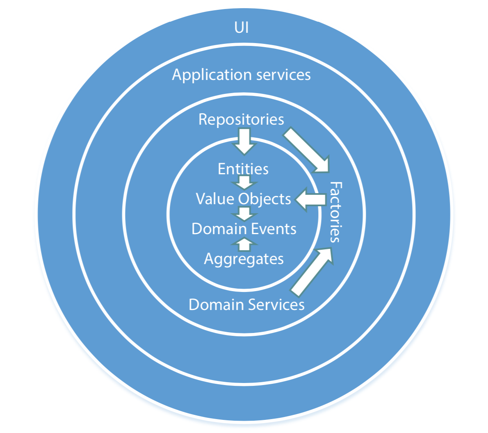

# Domain Driven Design Practice

## Area of Application for Domain-Driven Design
- [ ] Amount of data
- [ ] Performance
- [X] Business Logic Complexity
- [ ] Technical Complexity

Domain-driven Design only tries to solve business complexity. Whether the project
is simple or big.

## Why Domain-Driven Design?

## Main Concepts of Domain-driven Design
- `Ubiquitous language`
    - Bridges the gap between developers and experts
- `Bounded context`
    - Clear boundaries between different parts of the system
- `Core domain`
    - Focus on the most important part of the system

## Onion architecture and domain model isolation

## Testing in Domain-Driven Design
- Use `Unit Testing` for core domain only like `Entities`, `Value Objects`,
`Domain Events` and `Aggregates`. These are the parts which contains more
domain knowledge.

- For other parts of the codebase, use `Integration Testing`. This helps to
reduce mock or test doubles.

## Reference
- http://bit.ly/1hT842g