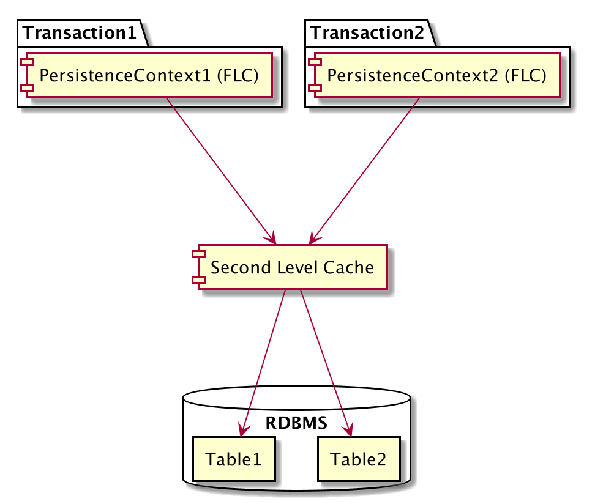

# Hibernate Caching

## Architecture
- 

## Second Level Cache
## Dependency
```xml
<dependency>
    <groupId>org.hibernate</groupId>
    <artifactId>hibernate-ehcache</artifactId>
</dependency>
```

## Configuration
- Enable second level cache
```spring.jpa.properties.hibernate.cache.use_second_level_cache = true```

- Specify the caching framework - EhCache
```spring.jpa.properties.hibernate.cache.region.factory_class = org.hibernate.cache.ehcache.internal.EhcacheRegionFactory```

- Only cache those entity which have @Cacheable(true)
```spring.jpa.properties.javax.persistence.sharedCache.mode = ENABLE_SELECTIVE```

- Enable ehcache debug logging
```logging.level.net.sf.ehcache=debug```

## Hibernate Logging

| category                           | description                                                                                                                                           |
| ---------------------------------- | ----------------------------------------------------------------------------------------------------------------------------------------------------- |
| org.hibernate                      | This category contains all messages written by Hibernate. You can use this to analyze unspecific issues or to find categories used by Hibernate.      |
|                                    | Be careful, setting this category to a fine log level might create a lot of log output.                                                               |
| org.hibernate.SQL                  | All SQL statements executed via JDBC are written to this log category.                                                                                |
|                                    | You can use it together with org.hibernate.type.descriptor.sql to get more information about the JDBC parameters and results.                         |
| org.hibernate.type.descriptor.sql  | Hibernate writes the values bound to the JDBC parameters and extracted from the JDBC results to this log category.                                    |
|                                    | This category should be used together with org.hibernate.SQL to also log the SQL statements.                                                          |
| org.hibernate.pretty               | Hibernate logs the state at flush time of max. 20 entities to this log category.                                                                      |
| org.hibernate.cache                | Information about second level cache activities is written to this log category.                                                                      |
| org.hibernate.stat                 | Hibernate writes some statistics for each query to this category. The statistics need to be activated separately (see Activate Hibernate Statistics). |
| org.hibernate.hql.internal.ast.AST | This category groups the HQL and SQL ASTs during query parsing.                                                                                       |
| org.hibernate.tool.hbm2ddl         | Hibernate writes the DDL SQL queries executed during schema migration to this log category.                                                           |
| org.hibernate.engine.internal      | Session Metrics for executed query                                                                                                                    |
